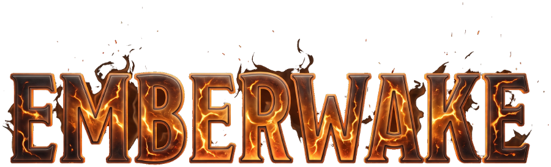
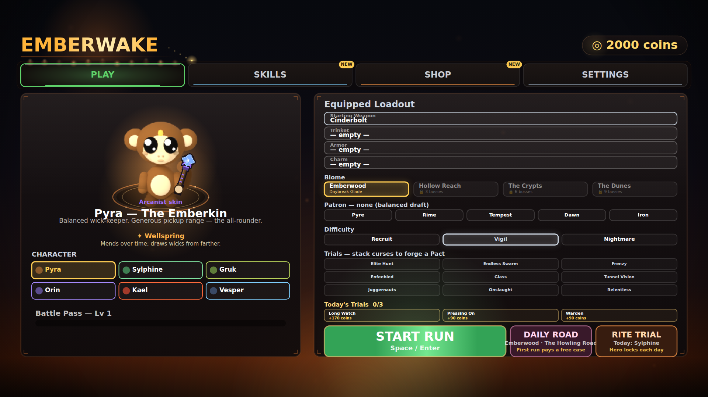
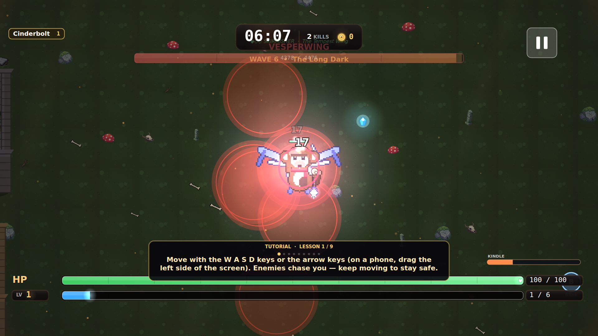
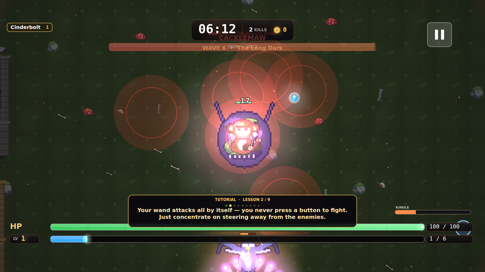

  

<h1 align="center">EMBERWAKE</h1>

<b>Hold the Last Light.</b>

  A dark-fantasy survivor auto-battler. Six monkey wick-keepers, a forge full of wands,
  and an endless swarm crawling out of the dark. <b>Free. No download. Plays in your browser.</b>

  <a href="https://qemmhd.github.io/2dgamerepo/"><b>▶&nbsp; PLAY NOW</b></a>
  &nbsp;·&nbsp; Free &nbsp;·&nbsp; iPhone · iPad · Android · Desktop &nbsp;·&nbsp; No ads · No accounts · No tracking

  <b>On iPhone:</b> open the link in Safari → tap <b>Share</b> → <b>Add to Home Screen</b> — it installs like a real app and runs full-screen offline.

---

## Screenshots

| Forge your run | Hold the swarm | Face the Twelve |
|:---:|:---:|:---:|
|  |  |  |
| Pick a hero, a biome, and stack curses into a Pact | Your wand fights on its own — you steer, dodge, and survive | Twelve telegraphed apex bosses, each with a second act |

---

## The pitch

You are a **wick-keeper** — one of the last monkeys tending the dying embers of the world.
The dark sends everything it has. Your wand answers on its own; your job is to **stay alive**,
grow monstrously powerful in fifteen minutes, and hold the last light one more night.

It's a **survivor / bullet-heaven roguelite** in the spirit of the genre's best — but built from
scratch as a hand-crafted, dark-fantasy **forge**: everything is earned, nothing is sold, and
the whole thing runs in a browser tab with zero install.

- 🐒 **Six heroes, six signatures.** Pyra the all-rounder, and five more wick-keepers — each
  with its own playstyle and a **Grand Signature** ultimate you aim and unleash by hand.
- 🔥 **40+ wands, evolutions & fusions.** Fire, frost, and shock arsenals that **combo** —
  freeze then shatter, ignite then detonate. Fuse dead-end wands into something new.
- ✋ **The Waking Hand.** After a whole run of auto-attacking, you finally *act*: a charged
  ult you aim, a short **aimed blink** to dodge the hit you see coming, and **Focus** to
  pin your fire on the boss.
- 🗡️ **Twelve apex bosses.** Each one telegraphs its attacks and turns at 50% into a fiercer
  **second act** — no cheap shots, all readable, all beatable.
- 🗺️ **Four biomes & the Wick Roads.** Emberwood, Hollow Reach, the Crypts, the Dunes —
  plus relic shrines, branching roads, **Rites**, and per-hero **Attunement** mastery.
- 🎴 **Share your run.** Every death and victory auto-mints a recap card, and a **daily Rite
  Trial** gives everyone the same seeded challenge to beat — pure clipboard, no backend.
- 📱 **Made for touch.** Drag to move, tap to blink, hold to Focus — designed hands-first for
  iPhone, and just as good with a keyboard.

---

## What's New

*The forge never cools. Version history, newest first — each update ships verified and live.*

### 🔨 BOSSFORGE — The Twelve Reforged &nbsp; · now rolling out
The bosses hit back harder. A rebuilt collision core keeps huge fights smooth even at the
enemy cap, every apex boss's enraged phase was audited and fixed (no more bosses that got
*easier* when cornered), and clearer attack telegraphs across the board. **Boss Rush** and a
rotating **Weekly Ember** challenge are on the way.

### ✋ KINDLED — The Waking Hand
The biggest gameplay leap yet: a **Kindle** meter that powers a per-hero **Grand Signature**
ultimate you aim yourself, a restored **aimed blink** dodge, **Focus** targeting, an elemental
**combo table** (Shatter · Thermal Shock · Detonate), one-time **Rites**, uncapped **Hero
Attunement**, a **daily Rite Trial**, and a full **touch control** scheme for phones. Every
new verb is optional — press nothing and it's still the game you know.

### 🔭 EMBERGLASS — The Keeper's Lens
Every run now mints a shareable **recap card** the moment it ends — "PYRA fell at 14:32 to the
Vinebacked Goliath" — posted straight from the game-over screen. Plus a **photo mode** with a
set of forge-themed lens filters.

### 🐒 REFORGED
The look, remade: five visibly distinct monkey hero bodies with real family animations
(idle · walk · cast · hurt · dash · death), a bespoke **wand armory** drawn in-hand, and
readable boss phase-2 fights — the foundation everything above is built on.

---

## Information

| | |
|---|---|
| **Category** | Action · Roguelite · Survivor / Bullet-heaven |
| **Price** | **Free** — no in-app purchases, no ads, no paywalls |
| **Requires** | Any modern browser. Installable as a full-screen app on iPhone/iPad (Safari → Add to Home Screen) and Android |
| **Size** | A browser tab — nothing to download or update |
| **Controls** | Touch (drag-to-move, tap-to-blink, hold-to-Focus) · Keyboard (WASD / arrows) |
| **Players** | Single-player |
| **Online** | None required — runs fully client-side, saves locally, plays offline once installed |
| **Privacy** | No accounts, no tracking, no data collected or sent. Your save lives in your own browser |
| **Language** | English |

<a href="https://qemmhd.github.io/2dgamerepo/"><b>▶&nbsp; Play EMBERWAKE →</b></a>

---

## Credits — third-party art

Most of EMBERWAKE's art is generated **procedurally in code**. The exception is a set of
**enemy spritesheets from the Universal LPC Spritesheet Generator** (Liberated Pixel Cup),
used under **OGA-BY 3.0 / CC-BY-SA 3.0 / GPL 3.0**. Full per-asset attribution (authors,
licenses, source URLs) is in [`src/assets/lpc/CREDITS.md`](src/assets/lpc/CREDITS.md) and
[`ASSET_CREDITS.md`](ASSET_CREDITS.md). Generator/collection:
<https://github.com/LiberatedPixelCup/Universal-LPC-Spritesheet-Character-Generator>

Built with vanilla JavaScript and the HTML5 Canvas — no engine, no bundler, no server. Deployed to GitHub Pages from <code>main</code>.
