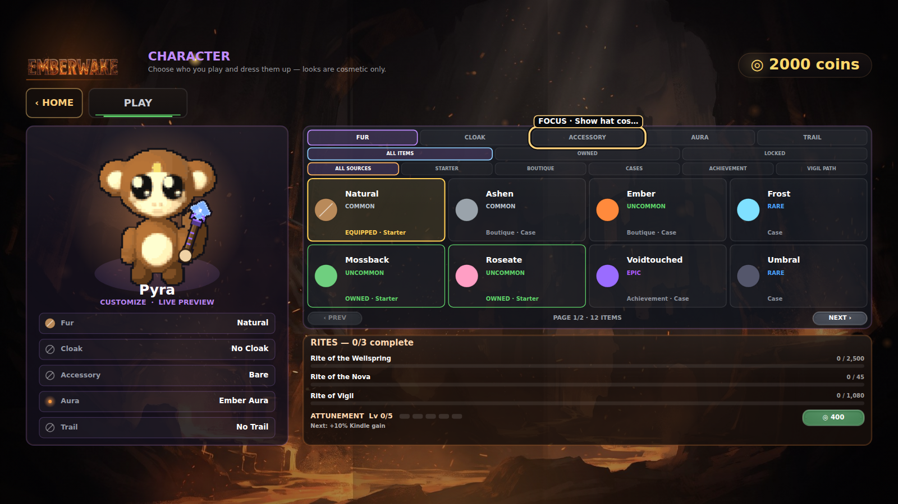
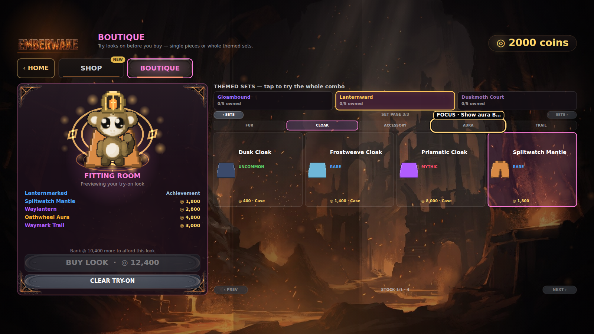

# Collection Growth I-A delivery and visual smoke

This receipt records the bounded Collection Growth I-A delivery from
[PR #198](https://github.com/QemmHD/2dgamerepo/pull/198), squash-merged as main
[`454e944`](https://github.com/QemmHD/2dgamerepo/commit/454e9442ed93dba47a84f469c8e7ed87d3b80f64),
on [the public GitHub Pages build](https://qemmhd.github.io/2dgamerepo/).

## Delivery identity

- Feature head: `4047f5571d9904eca4b898c7c8a14eb0e2eadf89`.
- PR CI:
  [`29367945521`](https://github.com/QemmHD/2dgamerepo/actions/runs/29367945521).
- Main CI:
  [`29368052366`](https://github.com/QemmHD/2dgamerepo/actions/runs/29368052366).
- Pages:
  [`29368052435`](https://github.com/QemmHD/2dgamerepo/actions/runs/29368052435).
- All three runs completed successfully at their expected event, branch, and exact SHA.

## Production-harness visual receipts

[PR #199](https://github.com/QemmHD/2dgamerepo/pull/199) CI
[`29369402619`](https://github.com/QemmHD/2dgamerepo/actions/runs/29369402619),
at head `e0c52ce2e8aa58aa6ada7bc9216eec45f4cc8408`, rendered these through the
real game Canvas and menu code at 1600×900. The harness waited for asynchronous art,
forced the settled menu frame, exported the exact Canvas with `toBlob()`, retained
keyboard focus, and reported `DONE EXC:0` for both states.

### Character Collection

- The live Pyra preview, five cosmetic slots, three filter rows, eight-card page,
  acquisition labels, page count, and enabled next-page route all rendered together.
- The visible frame records `PAGE 1/2 · 12 ITEMS` for Fur while the Accessory filter
  exposes a visible keyboard-focus treatment.
- Pixel gate: 1600×900, 92.61% non-black visible pixels, at least 33 colors, and
  luminance range 1–255.
- SHA-256: `E909D3EDF38F50C1ED85000569BE2BA323618C8089A7B21C637D8C0C385C5670`.

### Lanternward Boutique fitting room

- Set page 3/3 exposes Gloambound, Lanternward, and Duskmoth Court; Lanternward is
  selected and its real Splitwatch cloak, Waylantern, Oathwheel, and Waymark layers
  render on the shared live mannequin.
- The fitting-room receipt lists achievement-gated `fur_waylight`, four honest prices,
  the exact 12,400-coin effective add-on total, the 10,400-coin shortfall from the
  staged 2,000-coin wallet, and a disabled purchase without changing the economy.
- Cloak stock shows the real Splitwatch card and source-honest effective price while
  the Aura filter exposes a visible keyboard-focus treatment.
- Pixel gate: 1600×900, 91.35% non-black visible pixels, at least 33 colors, and
  luminance range 1–255.
- SHA-256: `73A21B52CEF4FEFF9018B3902056EA8AD5FE8FF4763391E2BF819C3936B35934`.

Both files were downloaded and manually inspected for primary-content clipping,
panel collisions, card overflow, broken art, and incorrect staged state. An earlier
OS-level screenshot attempt produced two valid but all-black PNGs; those files were
rejected rather than accepted as evidence. CI now fails closed on wrong dimensions,
low visible-pixel coverage, insufficient color/luminance range, malformed PNG data,
or byte-identical Character and Boutique captures.

## Hosted gates and deployed source smoke

The shipped feature gates passed with syntax **168/168**, validators **25/25**, and
**193,879** integrated assertions: Collection **8,080**; animated attachments
**5,268** across 162 frames/810 points; progression **5,313**; Run Path **93,139**;
HUD **14,001/180**; gambling **644** with the existing 93% theoretical Mines return;
accessibility **299**; and UX **97**.
PR #199's evidence branch then passed syntax **169/169** after adding the PNG receipt
validator; this does not retroactively change PR #198's 168-module feature boundary.

At `2026-07-14T21:27:34Z`, cache-busted public HTTP checks returned 200 for the index
and five shipped modules. The index was `text/html`; all modules were
`application/javascript`; and unique I-A markers were present in:

- `src/content/cosmetics.js`;
- `src/systems/CosmeticCollection.js`;
- `src/assets/PixelArt.js`;
- `src/assets/CosmeticFx.js`;
- `src/entities/Player.js`.

## Bounded claim

These receipts prove the named production-harness menu states, exact visual-capture
gate, hosted validator runs, deployed source seams, and Pages delivery. The images are
CI production-harness captures, not deployed-browser screenshots. They do not prove a
physical phone/tablet pass, manual assistive-technology pass, zoom convergence,
Duskmoth/case-reel visual acceptance, the separate 30-look Collection Growth I-B pack,
complete Collection Growth I, full 1.6, full 1.1, the 1.0 → 2.0 arc, or 2.0.
