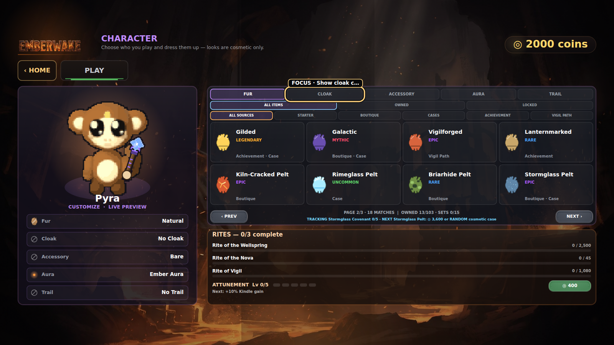
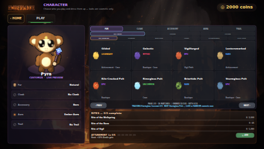
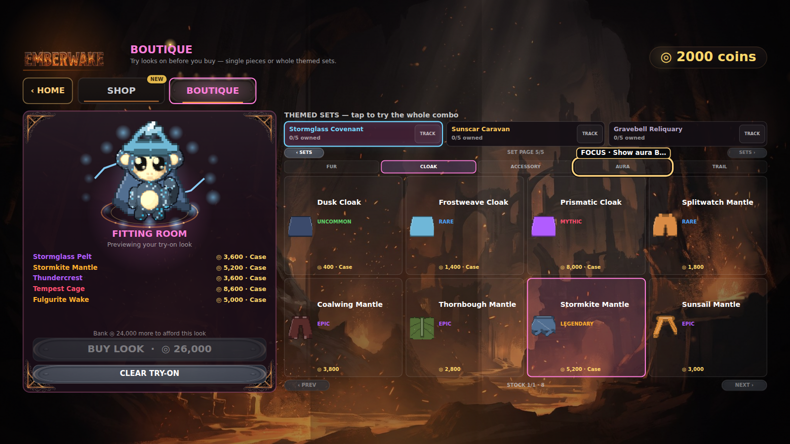
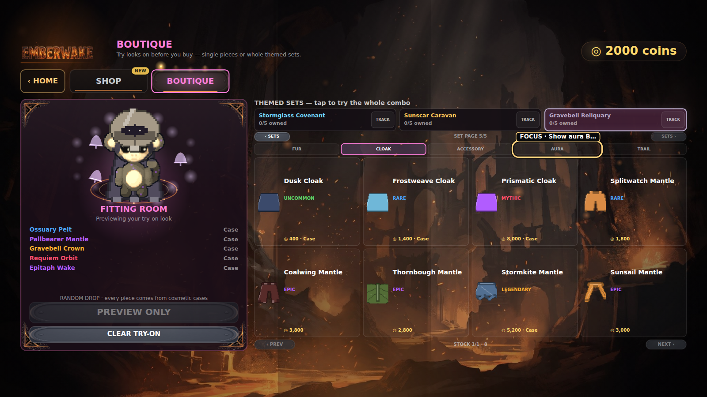

# Collection Growth I-B delivery and visual smoke

This receipt records the bounded Collection Growth I-B delivery from
[PR #200](https://github.com/QemmHD/2dgamerepo/pull/200), squash-merged as main
[`a34baca`](https://github.com/QemmHD/2dgamerepo/commit/a34bacafac2cd222e0a55c3e94545f6535a3acf2),
on [the public GitHub Pages build](https://qemmhd.github.io/2dgamerepo/).

## Delivery identity

- Feature head: `418ab779b8c879d1be5c8b7342bdc6a573008216`.
- PR CI:
  [`29373728825`](https://github.com/QemmHD/2dgamerepo/actions/runs/29373728825).
- Main CI:
  [`29373896220`](https://github.com/QemmHD/2dgamerepo/actions/runs/29373896220).
- Pages:
  [`29373896279`](https://github.com/QemmHD/2dgamerepo/actions/runs/29373896279).
- All three runs completed successfully at their expected event, branch, and exact SHA.
- Main CI artifact
  [`8327157493`](https://github.com/QemmHD/2dgamerepo/actions/runs/29373896220/artifacts/8327157493)
  is the source of the four durable PNGs below.

## Production-harness visual receipts

Main CI rendered the real game Canvas and menu code after the feature merge. Each
state finished with `DONE EXC:0`, retained its intended keyboard/touch focus mode,
passed a fail-closed PNG pixel gate, and was manually inspected at original detail.

### Character Collection — desktop

- The Fur category is on deterministic page 2/3 and reports `18 MATCHES`,
  `OWNED 13/103`, and `SETS 0/15`.
- The Stormglass pursuit receipt names its next missing item, exact deterministic
  3,600-coin Boutique route, and the case alternative without pretending a random
  drop is guaranteed.
- Pixel gate: 1600x900, 92.59% visible pixels, at least 33 colors, luminance 1–255.
- SHA-256: `70be3ab3479a6e853e71d069383e9f559792ef0e67069c7f70bde0494cf56f28`.

### Character Collection — production mobile backing tier

- The 844x390 CSS test window selected the production renderer's intentional 439x247
  Canvas backing tier. The same staged collection/pursuit state is present and no
  primary panel or footer is clipped. Readability/touch-density review is recorded
  separately from this geometric receipt.
- Pixel gate: 439x247, 94.19% visible pixels, at least 33 colors, luminance 1–255.
- SHA-256: `325e59c074493e535f00ddfec5531200077faa5f2c179526fd4102ddb38c8bf9`.

### Stormglass mixed-source fitting room

- All five attached Stormglass pieces render together on the live mannequin.
- The receipt exposes each deterministic Boutique price plus honest case eligibility,
  an exact 26,000-coin full-look price, and a 24,000-coin shortfall from the staged
  2,000-coin wallet.
- Pixel gate: 1600x900, 92.39% visible pixels, at least 33 colors, luminance 1–255.
- SHA-256: `a4bd80303af685b0277ef45cd08674f539901678759845337de577c83702249e`.

### Gravebell random-only fitting room

- All five attached Gravebell pieces render together, every piece is labeled `Case`,
  and the action is disabled as `PREVIEW ONLY`.
- The exact guidance reads `RANDOM DROP · every piece comes from cosmetic cases`; it
  does not invent a price or deterministic acquisition promise.
- Pixel gate: 1600x900, 92.38% visible pixels, at least 33 colors, luminance 1–255.
- SHA-256: `9f6f6cc40b3b3b99825ae19094645d5224652b57aafcaeb5c57c3cf1f50588ac`.

All four files are byte-distinct. Manual review found no primary-content clipping,
panel collisions, card overflow, broken art, detached cosmetic layer, or staged-state
contradiction. The Collection and Boutique controls intentionally reuse the game's
existing dark translucent card language; those panels are not capture corruption.

## Hosted gates and deployed source smoke

The feature boundary passed syntax **169/169**, validators **25/25**, and **198,394**
integrated assertions from validators that report explicit counts: Collection
**9,981**; animated attachments **7,332** across 162 frames/810 points; progression
**5,860**; Run Path **93,139**; HUD **14,001/180**; gambling **644** with the existing
93% theoretical Mines return; accessibility **299**; and UX **100**.

At `2026-07-14T22:48:18Z`–`2026-07-14T22:48:29Z`, cache-busted public HTTP checks
returned 200 for the index and six shipped modules. The index was `text/html`; all
modules were `application/javascript`; and the expected I-B markers were present in:

- `src/content/cosmetics.js` (`fur_kilncracked`);
- `src/assets/ProceduralSprites.js` (`deriveCosmeticFurPalette`);
- `src/assets/CosmeticFx.js` (`grave_bells`);
- `src/systems/SaveSystem.js` (`purchaseCosmeticLook`);
- `src/systems/MenuRenderer.js` (`MATCHES`);
- `src/core/Game.js` (`getEquippedCosmetics(this._heroId)`).

An initial probe deliberately searched `Game.js` for the save-owned `pursuitSetId`
marker and found none; the corrected live-render integration marker above passed. This
failed marker check was not counted as evidence.

## Save and transaction compatibility

The top-level save remains version 10. I-B adds validated `cosmetics.presets` and
`pursuitSetId` fields without deleting the legacy `cosmetics.equipped` compatibility
mirror. A legacy validated global look seeds all six hero presets; stored preset slots
must reference known, owned cosmetics in the correct category; an invalid pursuit id
fails closed. Selecting a hero refreshes the compatibility mirror, and Rite Trial
rendering resolves the run's `_heroId` rather than silently using the menu selection.

`purchaseCosmeticLook` commits the exact coin debit, new unlocks, hero preset, and
selected-hero mirror as one transaction; insufficient funds, unknown ids, wrong-slot
ids, and case-only purchase attempts mutate nothing. `equipCosmeticLook` applies the
same validation without charging. These paths are covered by the **5,860** progression
checks, including migration and round-trip fixtures.

## Economy boundary and watchpoint

I-B added no power, currency, Battle Pass reward, achievement, case cost, case odds,
pity rule, unowned-first weighting, duplicate refund, Mines stake, or Mines return
change. Kilnheart, Thorncrown, and Sunscar have deterministic Boutique routes;
Stormglass has both a deterministic 26,000-coin ceiling and random case routes;
Rimeglass and Gravebell are case-only.

Gravebell's Mythic `aura_requiem` therefore remains an explicit balance watchpoint,
not a hidden promise. A Royal Cosmetic Case has 1.5% Mythic odds and an 82% item
branch. With eight eligible Mythics and the current unowned-first behavior, a fresh
pool reaches a named Mythic after about 4.5 Mythic-item hits on average: roughly
365.9 cases or 329,000 gross coins before duplicate refunds. If `aura_requiem` is the
last unowned Mythic, the mean is about 81.3 cases or 73,000 gross coins. Rare+ pity
does not target Mythic and does not cap the named-item tail. The next collection-
completion slice must make an explicit Blueprint/direct-price ceiling decision before
calling random-only collection balance complete.

## Bounded claim

These receipts prove the named production-harness menu states, exact visual-capture
contract, hosted validators, deployed source seams, and Pages delivery. The images are
CI production-harness captures, not deployed-browser screenshots or physical-device
tests. They do not prove manual assistive-technology acceptance, the permanent chapter
shelf, export/recovery, broader completion analytics, a deterministic ceiling for
random-only Mythics, full
Collection Growth I, full 1.1, full 1.6, 2.0, or 2.8. `?dev=1` remains available and
does not grant collection progress by itself.
