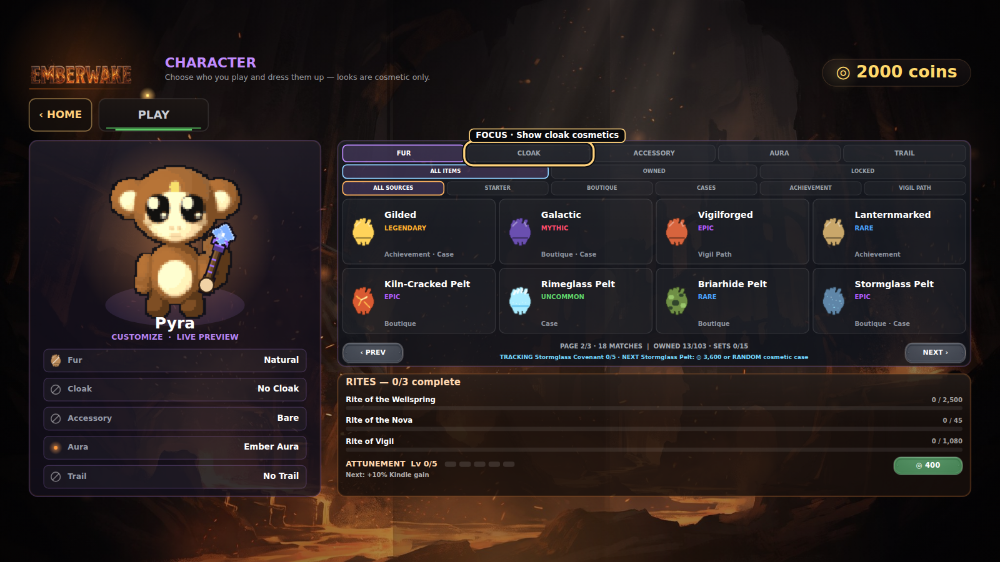
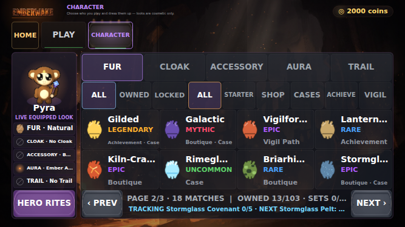
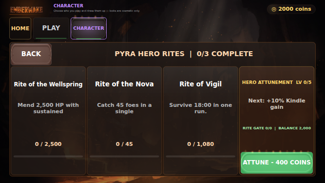
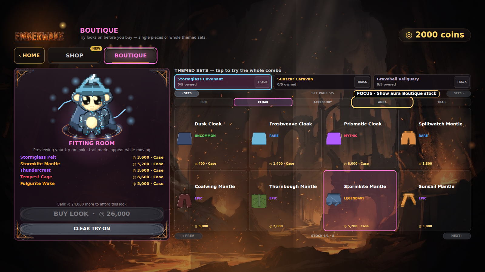
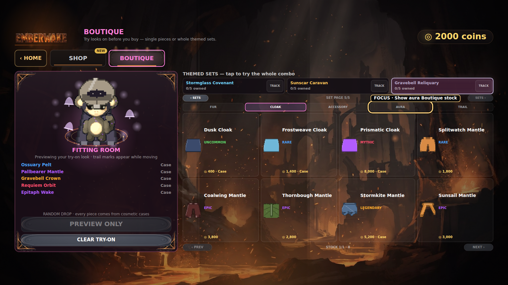

# Collection Growth I-B phone correction — PR receipt

This receipt records the bounded phone Character correction on
[PR #201](https://github.com/QemmHD/2dgamerepo/pull/201). It is additive to the
historical [PR #200 delivery receipt](collection-growth-ib-deployed-smoke.md); it does
not rewrite PR #200's four images, 439x247 phone backing, counts, or delivery identity.

## Pull-request identity

- Accepted feature head: `1322d3af42dd9c53a369cbc04b5994295270abb1`.
- Successful PR CI:
  [`29377897747`](https://github.com/QemmHD/2dgamerepo/actions/runs/29377897747).
- PR CI artifact:
  [`8328580576`](https://github.com/QemmHD/2dgamerepo/actions/runs/29377897747/artifacts/8328580576),
  `collection-growth-ib-visual-receipts`.
- The artifact contains five byte-distinct production-harness PNGs. Every state
  finished `DONE EXC:0`, passed the fail-closed pixel gate, and was manually reviewed
  at original resolution.
- Merge SHA, main CI, Pages, and deployed-source smoke are deliberately not claimed in
  this PR receipt. They belong in the post-merge reconciliation.

## What the correction proves

- Phone Character navigation exposes `HOME`, `PLAY`, and `CHARACTER`. Hero Rites is a
  session-only Character drill-in and never impersonates or acknowledges relic ATTUNE.
- Relic ATTUNE remains locked until its existing seen/discovery policy allows it.
  `SaveSystem.attuneRelic` independently rejects an undiscovered relic before reading
  levels, spending coins, mutating data, or writing persistence.
- The shared resolved-CSS classifier covers 932x430 -> 932x524.25, 667x375 ->
  667x375.19, 568x320 -> 568.89x320, and 480x270 -> 480x270 phone canvases while
  excluding the named tablet, desktop, portrait, and invalid fixtures.
- The 932px and 667px Character surfaces use the rich live-look layout. The 568px and
  480px surfaces use the compact eight-card layout. Section navigation, filters,
  collection cards, paging, Hero Rites back, and the enabled purchase action retain a
  measured minimum target of 44 CSS pixels.
- Escape returns Hero Rites to Collection before the section-to-Home route. Desktop
  rotation cannot let an invisible phone pane consume Escape, invalid pane values fail
  closed to Collection, and every guided-tour step/end resets the nested pane.
- `?dev=1` and its Settings-only QA controls remain present and gated from ordinary
  player URLs.

The 44 CSS-pixel acceptance floor is informed by Apple's current guidance that
frequently used game controls should be at least 44x44 points. This deterministic web
gate does not substitute for the still-open physical-device and assistive-technology
review: <https://developer.apple.com/design/human-interface-guidelines/game-controls>.

## Production-harness visual receipts

### Character Collection — desktop

- Fur page 2/3 exposes all eight reachable entries, `18 MATCHES`, `OWNED 13/103`,
  `SETS 0/15`, Stormglass next-source guidance, and visible keyboard focus.
- Pixel gate: 1600x900, 92.59% visible pixels, 33+ colors, luminance 1-255.
- SHA-256: `869ea262385bd88d408d59f0fbeddd1abc5206ad5e7aa58591791995473647e7`.

### Character Collection — exact phone viewport

- The calibrated inner viewport and Canvas backing are both exactly 667x375. The live
  hero/equipped rail, three filter rows, eight cards, paging, `HERO RITES`, and two-line
  pursuit footer remain inside the safe canvas.
- Harness receipts assert the 667x375 viewport/backing, resolved 667x375.19 CSS canvas,
  safe-area/content geometry, production runtime match, phone layout, navigation floor,
  Collection floor, and pursuit guidance.
- Pixel gate: 667x375, 93.97% visible pixels, 33+ colors, luminance 1-255.
- SHA-256: `1e30e0dfcb2e2c0784340d57d144c57ba071785b7c15c258342951377552665d`.

### Hero Rites — exact phone viewport

- Pyra's three exact Rites show names, descriptions, progress, and bars beside the
  existing Hero Attunement level, effect, rite gate, balance, and 400-coin purchase.
- The visible `BACK` label remains readable inside its touch target; its semantic label
  remains `Back to Character Collection`.
- Harness receipts assert the `rites` request, rendered pane, Character hotspot floor,
  pane floor, exact 667x375 viewport, and exact 667x375 backing.
- Pixel gate: 667x375, 93.98% visible pixels, 33+ colors, luminance 1-255.
- SHA-256: `fdd8853a55a76c77e671fbc133f0cdbdfd7fad950e86bd5643fc56d4e6498316`.

### Stormglass fitting room

- All five pieces and the real production trail effect render together. Exact piece
  prices, case eligibility, 26,000-coin look ceiling, 24,000-coin shortfall, and focus
  state remain visible.
- Pixel gate: 1600x900, 92.38% visible pixels, 33+ colors, luminance 1-255.
- SHA-256: `f346462bb0bb9a80e7ced9ee26391b5d2a0320011b6017b0ff386260d0c36066`.

### Gravebell fitting room

- All five pieces and the real production trail effect render together. Every piece is
  labeled `Case`, the action remains `PREVIEW ONLY`, and the random-drop guidance does
  not invent a deterministic price.
- Pixel gate: 1600x900, 92.38% visible pixels, 33+ colors, luminance 1-255.
- SHA-256: `ed920a9052c59323349b7e9f3ca41716848d018f75faf1e38af2ae77f2545103`.

Manual review found no primary-content clipping, panel collision, card overlap, broken
art, detached cosmetic layer, false route, or staged-state contradiction. The first PR
CI visual pass exposed one undersized visible back label even though its hotspot passed;
the label was corrected to `BACK`, and the five images above come only from the clean
second run.

## Deterministic boundary

The accepted feature head passes syntax **170/170**, validators **25/25**, and
**198,687** integrated assertions. Named gates are Collection **10,249**; animated
attachments **7,332** across 162 frames/810 points; progression **5,865**; Run Path
**93,139**; HUD **14,001** across 180 scenarios; gambling **644** with the unchanged
93% theoretical Mines return; accessibility **310**; and UX **109**. The CI workflow
YAML parses, `git diff --check` is clean apart from line-ending notices, and the
independent read-only acceptance review found no blocker.

The direct undiscovered-relic fixture proves a false result with byte-identical
in-memory JSON and persisted storage, unchanged balance/attunement state, and zero
storage writes. After discovery, the same known relic succeeds at the existing exact
cost. No save schema, Hero/Relic Attunement price, cosmetic power, case cost/odds/pity,
unowned weighting, duplicate refund, Mines stake/return, Battle Pass reward, or
achievement reward changed.

## Bounded claim

This receipt proves the PR feature head, remote Chromium production-harness states,
deterministic phone layouts, semantic routing, and save-layer relic authority. It does
not yet prove deployment, physical devices, screen readers/Voice Control, 200% zoom,
portrait/tablet layouts, complete Collection Growth I, Collection Completion Truth,
full 1.1/1.6, 2.0, or 2.8.
